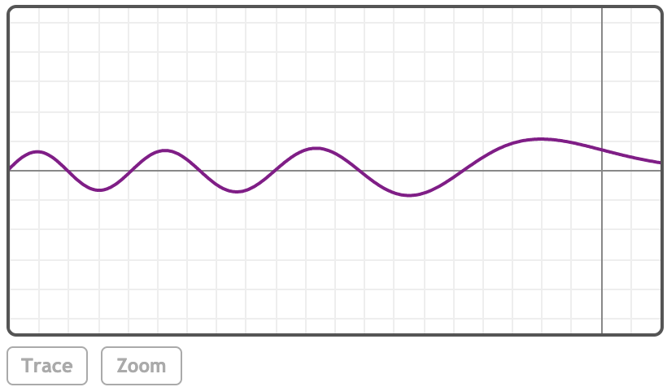

### AiryAi(z)

***z***
<br>
实数或复数

### 描述

返回艾里函数Ai(z)。

### 示例

[在MathStudio中浏览](http://mathstud.io/?input[0]=QWlyeUFpKDIp&input[1]=QWlyeUFpKDMtQGkp&input[2]=QWlyeUFpKEBwaS8yKQ%3D%3D&input[3]=QWlyeUFpKC05KQ%3D%3D&input[4]=UGxvdChBaXJ5QWkoeCkseD1bLTEwLDFdLG51bWJlcnM9MCk%3D)

> ```math
> AiryAi(2)
> ```
>
> $0.034924130423$

> ```math
> AiryAi(3-@i)
> ```
>
> $-0.00180757365 + 0.007307239954i$

> ```math
> AiryAi(@pi/2)
> ```
>
> $0.065120493712$

> ```math
> AiryAi(-9)
> ```
>
> $-0.022133653368$

> ```math
> Plot(AiryAi(x), x=[-10, 1], numbers=0)
> ```
>
> 

### 引用

http://mathworld.wolfram.com/AiryFunctions.html 艾里函数(来自Wolfram)

http://en.wikipedia.org/wiki/Airy_function 艾里函数(来自Wikipedia)

### 相关函数

*[AiryBi](A/AiryBi), [BesselI](B/BesselI)*
