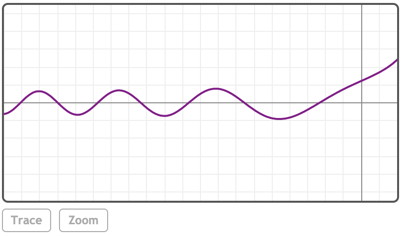

### AiryBi(z)

***z***
<br>
实数或复数

### 描述

返回艾里函数Bi(z)。

### 示例

[在MathStudio中浏览](http://mathstud.io/?input[0]=QWlyeUJpKDAp&input[1]=QWlyeUJpKDEwKQ%3D%3D&input[2]=QWlyeUJpKDErQGkp&input[3]=UGxvdChBaXJ5QmkoeCkseD1bLTEwLDFdLG51bWJlcnM9MCk%3D)

> ```math
> AiryBi(0)
> ```
>
> $0.614926627446$

> ```math
> AiryBi(10)
> ```
>
> $455641153.548224925995$

> ```math
> AiryBi(1+@i)
> ```
>
> $0.716658073383 + 0.619889290401i$

> ```math
> Plot(AiryBi(x), x=[-10, 1], numbers=0)
> ```
>
> 

### 引用

http://mathworld.wolfram.com/AiryFunctions.html 艾里函数(来自Wolfram)

http://en.wikipedia.org/wiki/Airy_function 艾里函数(来自Wikipedia)

### 相关函数

*[AiryAi](A/AiryAi), [BesselI](B/BesselI)*
