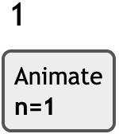
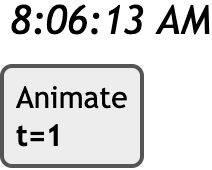
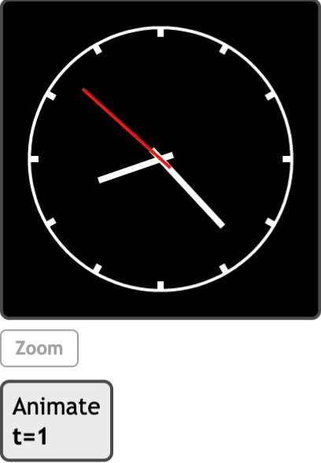

### Animate(*variable, start, end, [step], [value], [fps]*)

***variable***
<br>
变量或变量列表

***start***
<br>变量循环的最小值

***end***
<br>
变量循环的最大值

***[step]***
<br>
变量在每帧都增加此值

***[value]***
<br>
首次循环中变量从此值开始

***[fps]***
<br>
每秒的帧数

### 描述

这个函数创建一个动画条目。**variable**在首次循环中从**value**开始，之后的循环中从**start**开始，每一帧按**step**递增并重新计算动画条目。

当**variable**大于**end**时，将其重新设置为**start**。

### 示例

[在MathStudio中浏览](http://mathstud.io/?input[0]=QW5pbWF0ZShuLDEsMTAwLDEsMSwxMCkNCm5eMg%3D%3D&input[1]=QW5pbWF0ZSh0LDEsNjAsMSwxLDEpDQpkYXRlKCJoOjBpOjBzIEEiKQ%3D%3D&input[2]=QW5pbWF0ZSh0LDEsNjAsMSwxLDEpDQpmb3IgaSBpbiAxLi4xMg0KIFBhcmFtZXRyaWNQbG90KHUqc2luKChpLTEpKkBwaS82KSx1KmNvcygoaS0xKSpAcGkvNiksdT1bMC45MywxLDJdLGxpbmVzPTQsY29sb3I9d2hpdGUpDQplbmQNClBhcmFtZXRyaWNQbG90KHNpbih1KSxjb3ModSksdT1bMCwyQHBpLDEwMF0sbGluZXM9Mixjb2xvcj13aGl0ZSkNClBhcmFtZXRyaWNQbG90KHUqc2luKChkYXRlKGgpK2RhdGUoaSkvNjApKkBwaS82KSx1KmNvcygoZGF0ZShoKStkYXRlKGkpLzYwKSpAcGkvNiksdT1bLTAuMSwwLjUsMl0sbGluZXM9NCxjb2xvcj13aGl0ZSkNClBhcmFtZXRyaWNQbG90KHUqc2luKChkYXRlKGkpK2RhdGUocykvNjApKkBwaS8zMCksdSpjb3MoKGRhdGUoaSkrZGF0ZShzKS82MCkqQHBpLzMwKSx1PVstMC4xLDAuNywyXSxsaW5lcz00LGNvbG9yPXdoaXRlKQ0KUGFyYW1ldHJpY1Bsb3QodSpzaW4oZGF0ZShzKSpAcGkvMzApLHUqY29zKGRhdGUocykqQHBpLzMwKSx1PVstMC4xLDAuOCwyXSxsaW5lcz0yLGNvbG9yPXJlZCkNClBsb3QoZ3JpZD0wLGF4aXM9MCxiYWNrZ3JvdW5kPWJsYWNrLG51bWJlcnM9MCxtb3ZlPTAsd2lkdGg9MjAwLGhlaWdodD0yMDAp)

> ```math
> Animate(n, 1, 100, 1, 1, 10)
> n^2
> ```
>
> 

> ```math
> Animate(t, 1, 60, 1, 1, 1)
> date("h:0i:0s A")
> ```
>
> 

> ```math
> Animate(t,1,60,1,1,1)
> for i in 1..12
>  ParametricPlot(u*sin((i-1)*@pi/6),u*cos((i-1)*@pi/6),u=[0.93,1,2],lines=4,color=white)
> end
> ParametricPlot(sin(u),cos(u),u=[0,2@pi,100],lines=2,color=white)
> ParametricPlot(u*sin((date(h)+date(i)/60)*@pi/6),u*cos((date(h)+date(i)/60)*@pi/6),u=[-0.1,0.5,2],lines=4,color=white)
> ParametricPlot(u*sin((date(i)+date(s)/60)*@pi/30),u*cos((date(i)+date(s)/60)*@pi/30),u=[-0.1,0.7,2],lines=4,color=white)
> ParametricPlot(u*sin(date(s)*@pi/30),u*cos(date(s)*@pi/30),u=[-0.1,0.8,2],lines=2,color=red)
> Plot(grid=0,axis=0,background=black,numbers=0,move=0,width=200,height=200)
> ```
>
> 

### 相关函数

*[CheckBox](C/CheckBox), [Slider](S/Slider)*
