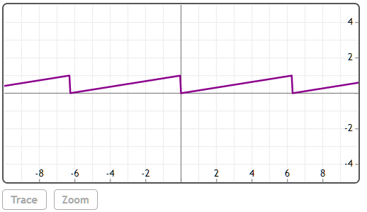

## SawToothWave(x, [T])


创建一个周期为T的预定义2D锯齿波。T的默认值为$2 \pi$。

## 举例  
[在Mathstudio上浏览](http://mathstud.io/?input[0]=UGxvdChTYXdUb290aFdhdmUoeCkp)


>   ```math
>   Plot(SawToothWave(x))
>   ```
>   

