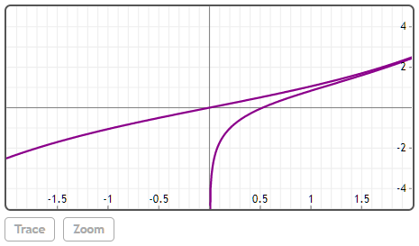

## Shi(z)

### z
实数或复数。

## 说明
求z的双曲正弦积分。


## 举例  
[在Mathstudio上浏览](http://mathstud.io/?input[0]=U2hpKDEp&input[1]=U2hpKDIrM0BpKQ%3D%3D&input[2]=UGxvdChbU2hpKHgpLENoaSh4KV0seD1bLTIsMl0seT1bLTUsNV0p)


>   ```math
>   Shi(1)
>   ```
>   $ 1.057250875376$


>   ```math
>   Shi(2+3@i)
>   ```
>   $ -0.193189076272+2.645432555362i$


>   ```math
>   Plot([Shi(x), Chi(x)], x=[-2, 2], y=[-5, 5])
>   ```
>   


## 参考

http://mathworld.wolfram.com/Shi.html

## 相关函数

[Chi](C/Chi)