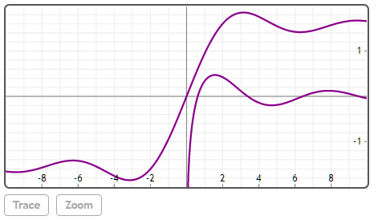

## Si(z)

### z

实数或复数。

## 说明

z的正弦积分。

## 举例  
[在Mathstudio上浏览](http://mathstud.io/?input[0]=W1NpKDApLCBTaShAaW5mKSwgU2koLUBpbmYpLCBTaSgteCld&input[1]=Zm9yIGkgaW4gMS4uMw0KIGEgQD0gU2koaSkNCiBiIEA9IENpKGkpDQplbmQNClthLCBiXQ%3D%3D&input[2]=U2koMitAaSk%3D&input[3]=UGxvdChbU2koeCksIENpKHgpXSwgeD1bLTEwLCAxMF0sIHk9Wy0yLCAyXSk%3D)


>   ```math
>   [Si(0), Si(@inf), Si(-@inf), Si(-x)]
>   ```
>   $ \left[0, \frac{\pi}{2},-\frac{\pi}{2},-\mathrm{Si}(x)\right] $


>   ```math
>	for i in 1..3
>	 a @= Si(i)
>	 b @= Ci(i)
>	end
>	[a, b]
>   ```
>   <table>
>       <tr>
>           <th>0.946083070367</th>
>           <th>1.605412976803</th>
>           <th>1.848652527999</th>
>       </tr>
>       <tr>
>           <th>$\gamma-0.239811742001$</th>
>           <th>$\gamma+\ln (2)-0.847382016687$</th>
>           <th>$\gamma+\ln (3)-1.556198167562$</th>
>       </tr>
>   </table>


>   ```math
>   Si(2+@i)
>   ```
>   $ 1.833209921505+0.457691711287i $

>   ```math
>   Plot([Si(x), Ci(x)], x=[-10, 10], y=[-2, 2])
>   ```
>   


## 参考

http://mathworld.wolfram.com/SineIntegral.html

http://en.wikipedia.org/wiki/Trigonometric_integral#Sine_integral


## 相关函数

[Ci](C/Ci)

