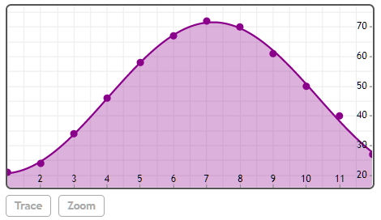

## SinFitPlot([x], y)

将数据拟合并绘制为a*sin(b*x+c)+d的形式。


## 举例

[在Mathstudio上浏览](http://mathstud.io/?input[0]=U2luRml0UGxvdChbMjEsMjQsMzQsNDYsNTgsNjcsNzIsNzAsNjEsNTAsNDAsMjddKQ%3D%3D)


>   ```math
>   SinFitPlot([21, 24, 34, 46, 58, 67, 72, 70, 61, 50, 40, 27])
>   ```
>   