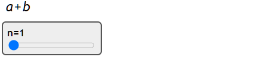
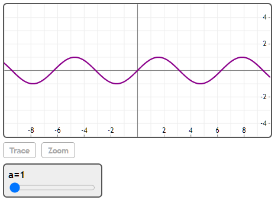
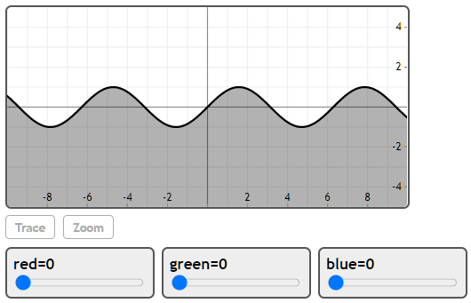

## Slider(variable, start, end, [step], [initial value])

Slider函数使用滚动条动态更改变量或变量列表的值。
(注：本小节当中的例子可以通过调整滚动条来改变输出结果，但本文档中仅仅是静态图片无法实现动态效果，若想查看动态实例请点击下方"在Mathstudio上浏览")


## 举例

[在Mathstudio上浏览](http://mathstud.io/?input[0]=U2xpZGVyKG4sIDEuLjgpDQpFeHBhbmQoKGErYilebik%3D&input[1]=U2xpZGVyKGEsIDEuLjEwIC0%2BIDAuMSkNClBsb3Qoc2luKGEqeCkp&input[2]=U2xpZGVyKFtyZWQsZ3JlZW4sYmx1ZV0sIDAuLjEgLT4gMC4wMSkNClBsb3Qoc2luKHgpLHNoYWRlPWJvdHRvbSxjb2xvcj1bcmVkLGdyZWVuLGJsdWVdKQ%3D%3D)


>   ```math
>   Slider(n, 1..8)
>   Expand((a+b)^n)
>   ```
>     

>   ```math
>   Slider(a, 1..10 -> 0.1)
>   Plot(sin(a*x))
>   ```
>     

>   ```math
>   Slider([red, green, blue], 0..1 -> 0.01)
>   Plot(sin(x), shade=bottom, color=[red, green, blue])
>   ```
>     


## 相关函数

[CheckBox](C/CheckBox)
