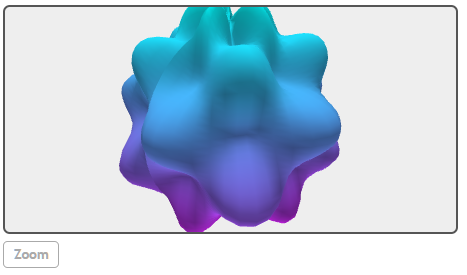
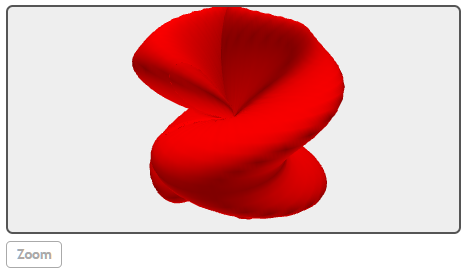
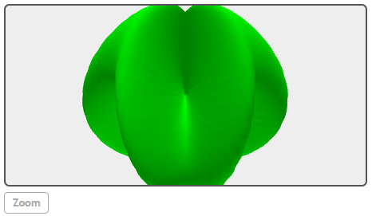

## SphericalPlot3D(expression, ...)

在球坐标中绘制3D图形。


## 举例  
[在Mathstudio上浏览](http://mathstud.io/?input[0]=U3BoZXJpY2FsUGxvdDNEKDErMS81KnNpbig2KkB0aGV0YSkqc2luKDUqQHBoaSksIEB0aGV0YT1bMCxAcGksNjBdLCBAcGhpPVswLDJAcGksNjBdLCBheGlzPTAsIGxpbmVzPTAsIGNvbG9ycz1bY3lhbiwgbWFnZW50YV0p&input[1]=U3BoZXJpY2FsUGxvdDNEKDIqc2luKEBwaGkrY29zKDRAdGhldGEpKSxAdGhldGE9WzAsMkBwaSwxMjBdLEBwaGk9WzAsQHBpLDEyMF0sY29sb3I9cmVkLGxpbmVzPTAsYXhpcz0wKQ%3D%3D&input[2]=U3BoZXJpY2FsUGxvdDNEKDIqc2luKEBwaGkrY29zKDRAdGhldGEpKSxAcGhpPVswLEBwaSwxMjBdLEB0aGV0YT1bMCwyQHBpLDEyMF0sY29sb3I9bGltZSxsaW5lcz0wLGF4aXM9MCk%3D)


>   ```math
>   SphericalPlot3D(1+1/5*sin(6*@theta)*sin(5*@phi), @theta=[0, @pi, 60], @phi=[0, 2@pi, 60], axis=0, lines=0, colors=[cyan, magenta])
>   ```
>   

>   ```math
>   SphericalPlot3D(2*sin(@phi+cos(4@theta)), @theta=[0, 2@pi, 120], @phi=[0, @pi, 120], color=red, lines=0, axis=0)
>   ```
>   

>   ```math
>   SphericalPlot3D(2*sin(@phi+cos(4@theta)), @phi=[0, @pi, 120], @theta=[0, 2@pi, 120], color=lime, lines=0, axis=0)
>   ```
>   


## 相关函数

[CylindricalPlot3D(expression, ...)](C/CylindricalPlot3D)
[ParametricPlot3D(expression, ...)](P/ParametricPlot3D)
[Plot3D(expression, ...)](P/Plot3D)