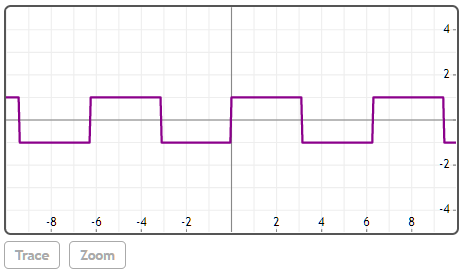
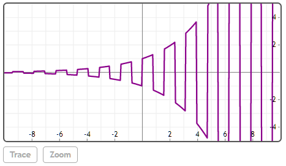

## SquareWave(x, [T])


### [T]
默认值为2π。

## 说明

SquareWave是预定义的2D绘图函数。 它创建周期为T的方波。


## 举例  
[在Mathstudio上浏览](http://mathstud.io/?input[0]=UGxvdChTcXVhcmVXYXZlKHgpKQ%3D%3D&input[1]=U3F1YXJlV2F2ZSh4LEBwaS8yKQ%3D%3D&input[2]=UGxvdChTcXVhcmVXYXZlKHgsQHBpLzIpKmV4cCh4LzMpKQ%3D%3D)


>   ```math
>   Plot(SquareWave(x))
>   ```
>   


>   ```math
>   SquareWave(x, @pi/2)
>   ```
>   $ (-1)^{f \operatorname{loor}(4 x / \pi)} $


>   ```math
>   Plot(SquareWave(x, @pi/2)*exp(x/3))
>   ```
>   

