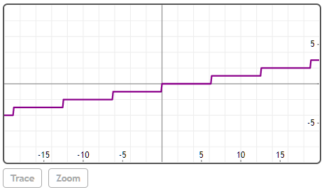
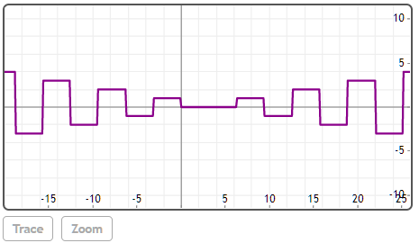

## StaircaseWave(x, [T])


### [T]

默认值为2π。

## 说明

创建周期为T的预定义2D阶梯波。


## 举例  
[在Mathstudio上浏览](http://mathstud.io/?input[0]=UGxvdChTdGFpckNhc2VXYXZlKHgpLHg9Wy0yMCwyMF0p&input[1]=UGxvdChTdGFpckNhc2VXYXZlKHgpKlNxdWFyZVdhdmUoeCkseD1bLTIwLDI2XSk%3D)


>   ```math
>   Plot(StairCaseWave(x), x=[-20, 20])
>   ```
>   


>   ```math
>   Plot(StairCaseWave(x)*SquareWave(x), x=[-20, 26])
>   ```
>   


