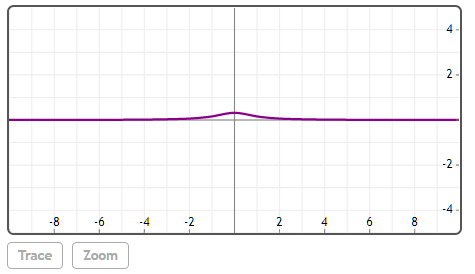

## StudentTPDF(x, df)

### x
非负实数

### df
正实数


## 说明

计算自由度为df的值x的Student-t概率密度函数。


## 举例  
[在Mathstudio上浏览](http://mathstud.io/?input[0]=UGxvdChTdHVkZW50VFBERih4LDEpKQ%3D%3D)


>   ```math
>   Plot(StudentTPDF(x, 1))
>   ```
>   


## 参考

http://en.wikipedia.org/wiki/Student_t_distribution

## 相关函数

[StudentTCDF](S/StudentTCDF)

