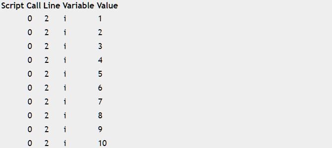
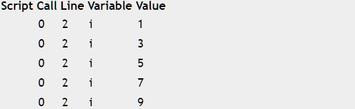
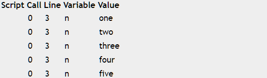

## Trace(variable)

Trace输出用于调试的变量的值。


## 举例  
[在Mathstudio上浏览](http://mathstud.io/?input[0]=Zm9yIGkgaW4gMS4uMTANCiB0cmFjZShpKQ0KZW5k&input[1]=Zm9yIGkgaW4gMS4uMTAgLT4gMg0KIHRyYWNlKGkpDQplbmQ%3D&input[2]=bnVtYmVycyA9IFtvbmUsIHR3bywgdGhyZWUsIGZvdXIsIGZpdmVdDQpmb3IgbiBpbiBudW1iZXJzDQogdHJhY2UobikNCmVuZA%3D%3D)


>   ```math
>   for i in 1..10	 
>       trace(i)
>   end
>   ```
>   


>   ```math
>   for i in 1..10 -> 2
>       trace(i)
>   end
>   ```
>   


>   ```math
>   numbers = [one, two, three, four, five]
>   for n in numbers
>       trace(n)
>   end
>   ```
>   

