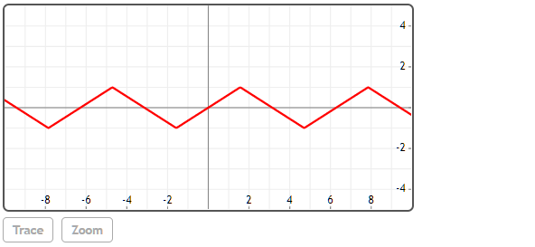
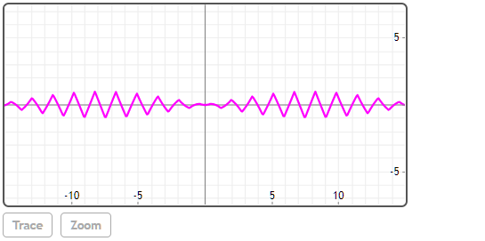

## TriangleWave(x, [T])

### [T]

在没有给出具体周期是默认是2π。

## 说明
TriangleWave是一个预定义的2D绘图函数，可绘制三角波。


## 举例  
[在Mathstudio上浏览](http://mathstud.io/?input[0]=UGxvdChUcmlhbmdsZVdhdmUoeCksY29sb3I9cmVkKQ%3D%3D&input[1]=UGxvdChUcmlhbmdsZVdhdmUoeCxAcGkvMikqc2luKHgvNSksY29sb3I9bWFnZW50YSx4PVstMTUsMTVdKQ%3D%3D)


>   ```math
>   Plot(TriangleWave(x), color=red)
>   ```
>   

>   ```math
>   Plot(TriangleWave(x, @pi/2)*sin(x/5), color=magenta, x=[-15, 15])
>   ```
>   
