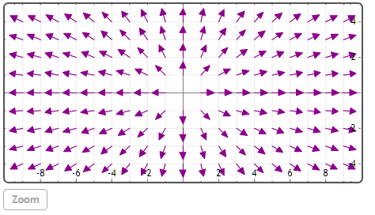
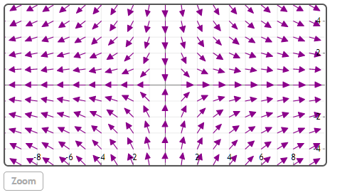
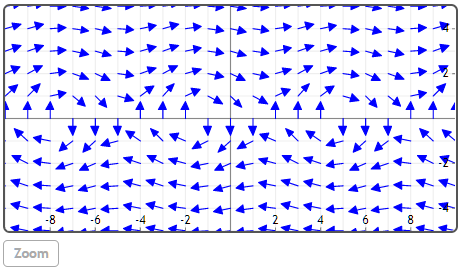

## VectorPlot(list, ...)

绘制二维向量场。


## 举例  
[在Mathstudio上浏览](http://mathstud.io/?input[0]=VmVjdG9yUGxvdChbeCx5XSk%3D&input[1]=VmVjdG9yUGxvdChbeCwteV0p&input[2]=VmVjdG9yUGxvdChbeSwtY29zKHgpXSwgY29sb3I9Ymx1ZSk%3D)


>   ```math
>   VectorPlot([x, y])
>   ```
>   

>   ```math
>   VectorPlot([x, -y])
>   ```
>   

>   ```math
>   VectorPlot([y, -cos(x)], color=blue)
>   ```
>   


## 参考
http://en.wikipedia.org/wiki/Vector_field
## 相关函数

[MultiPlot](M/MultiPlot)

[Plot](P/Plot)