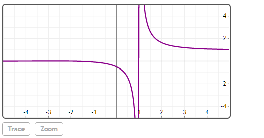

## Zeta(z, [a])

### z

实数或复数。

### [a]

整数或半整数。

## 说明

如果未给出a，则找到黎曼Zeta。

如果给出a，则找到Hurwitz Zeta函数。


## 举例  
[在Mathstudio上浏览](http://mathstud.io/?input[0]=WmV0YSgwKQ%3D%3D&input[1]=WmV0YSgxKQ%3D%3D&input[2]=WmV0YSgtMSk%3D&input[3]=WmV0YSg4KQ%3D%3D&input[4]=WmV0YSg1K0BpKQ%3D%3D&input[5]=WmV0YSgtMy41KQ%3D%3D&input[6]=WmV0YSg4KQ%3D%3D&input[7]=UGxvdChaZXRhKHgpLHg9Wy01LDVdLHk9Wy01LDVdKQ%3D%3D&input[8]=WmV0YSgwLGEp&input[9]=WmV0YSgtMyxhKQ%3D%3D&input[10]=WmV0YSh6LDUvMik%3D&input[11]=WmV0YSh6LC01LzIp)


>   ```math
>   Zeta(0) 
>   ```
>   $ -\frac{1}{2} $


>   ```math
>   Zeta(1) 
>   ```
>   ComplexInfinity


>   ```math
>   Zeta(-1) 
>   ```
>   $-\frac{1}{12}$


>   ```math
>   Zeta(8) 
>   ```
>   $0.000105820106 \pi^{8}$


>   ```math
>   Zeta(5+@i)
>   ```
>   $1.025978818823-0.025151082325i$

>   ```math
>   Zeta(-3.5)
>   ```
>   $\frac{1.359036889011}{\pi^{5}}$

>   ```math
>   Plot(Zeta(x), x=[-5, 5], y=[-5, 5])
>   ```
>   

>   ```math
>   Zeta(0, a)
>   ```
>   $-a+\frac{1}{2}$

>   ```math
>   Zeta(-3, a)
>   ```
>   $\frac{-a^{4}-a^{2}+2 a^{3}+\frac{1}{30}}{4}$

>   ```math
>   Zeta(z, 5/2)
>   ```
>   $(2 z-1) \operatorname{Zeta}(z)-2 z(3(-z)+1(-z))$

>   ```math
>   Zeta(z, -5/2)
>   ```
>   $(2 z-1) \operatorname{Zeta}(z)+2 z(-1)(-z)(5(-z)+3(-z)+1)$


## 参考

http://mathworld.wolfram.com/RiemannZetaFunction.html


http://en.wikipedia.org/wiki/Riemann_zeta_function